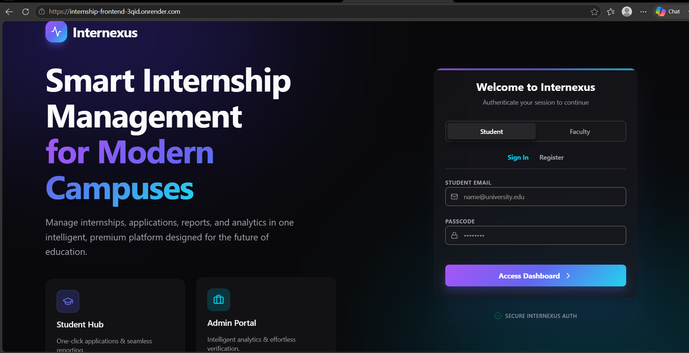
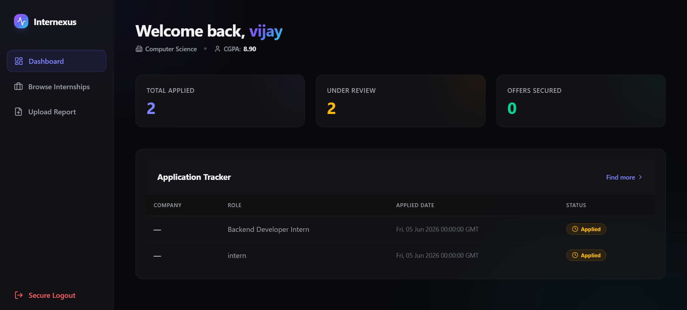
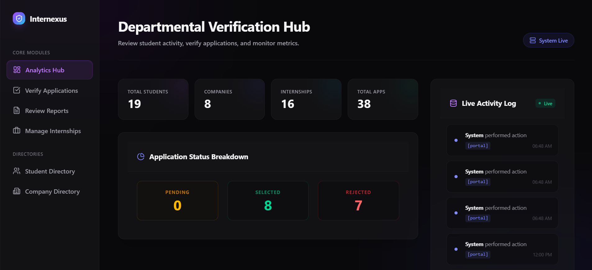

# Internship Tracking Portal

## Screenshots

### Login Page


### Student Dashboard


### Admin Dashboard



## Live Demo

Frontend:
https://internship-frontend-3qid.onrender.com

Backend API:
https://internship-backend-5ymz.onrender.com

## Project Overview

The Internship Tracking Portal provides a centralized platform for managing internship activities within an academic institution. It integrates student records, internship opportunities, application tracking, report management, and faculty verification workflows into a single system.

## Key Features

### Student Module

* Student Registration & Login
* Browse Internship Opportunities
* Apply for Internships
* Track Application Status
* Upload Internship Reports

### Faculty/Admin Module

* Secure Admin Authentication
* Application Verification
* Approve / Reject Internship Applications
* Review Student Reports
* Analytics Dashboard
* Activity Monitoring

### Database Features

* Relational data management using MySQL
* Activity logging using MongoDB
* Database View: `student_application_view`
* Trigger: `prevent_invalid_cgpa`
* Foreign Key & Integrity Constraints

## Tech Stack

### Frontend

* React.js
* Vite
* Tailwind CSS

### Backend

* Python
* Flask
* REST APIs

### Database

* MySQL (Railway)
* MongoDB Atlas

### Deployment

* Render (Frontend & Backend)
* Railway (MySQL)
* MongoDB Atlas (Cloud Database)

## Project Structure

```text
backend/      Flask APIs and business logic
frontend/     React frontend application
database/     SQL schema, sample data and scripts
docs/         Report, presentation and diagrams
```

## Documentation

Project deliverables are available in the `docs` directory:

* Project Report
* Presentation (PPT)
* Database Diagrams
* Project Poster

## Team Members

* Prashant Gourav
* Mohan Murari Sharma
* Bhavika Chandar
* Shivangi Tiwari

## Academic Project

This project was developed as part of a Database Management Systems (DBMS) academic project and demonstrates the integration of frontend development, backend services, relational databases, cloud databases, and deployment platforms.
